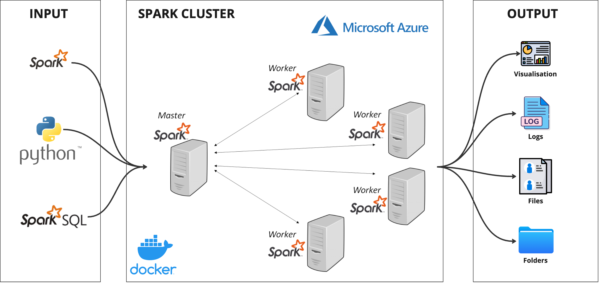

# Japan Visa Analysis:  Data Engineering

Este proyecto ofrece un procesamiento de datos y visualización de extremo a extremo de números de visas en Japón utilizando PySpark y Plotly. Los clústeres de Spark se configuran dentro de un contenedor Docker en Azure.

## Tabla de contenido

- [System Architecture](#system-architecture)
- [Configuracion](#configuracion)
- [Uso](#uso)
- [Features](#caracteristicas)
- [Notes](#notas)

## System Architecture

## Configuracion

1. **Cuenta de Azure**: Asegúrate de tener una cuenta activa en Azure.
2. **Docker**: La arquitectura maestro-trabajador de Spark se configura en un contenedor Docker en Azure.
3. **Bibliotecas de Python**: Instala las bibliotecas de Python necesarias:
   - PySpark
   - Plotly Express
   - pycountry
   - pycountry_convert
   - fuzzywuzzy

## Uso

1. **Entrada de Datos**: Coloca tu archivo CSV con el nombre `visa_number_in_japan.csv` en el directorio `input`.
2. **Ejecutar el Script**: Ejecuta el script de Python proporcionado.
3. **Visualizaciones**: Después de la ejecución, encontrarás las visualizaciones guardadas como archivos HTML en el directorio `output`.
4. **Datos Limpios**: Los datos limpios también se guardarán como un archivo CSV en el directorio `output`.

## Caracteristicas

- **Arquitectura del Sistema**: La arquitectura maestro-trabajador de Spark se configura en un contenedor Docker en Azure.
- **Ingestión de Datos**: El script ingiere el archivo CSV que contiene los números de visas en Japón.
- **Limpieza de Datos**: El script estandariza los nombres de las columnas, elimina columnas nulas y corrige nombres de países mediante coincidencia difusa.
- **Transformación de Datos**: Los datos se enriquecen aún más agregando información de continente para cada país.
- **Visualización de Datos**: Los datos limpios y transformados se visualizan mediante Plotly Express para proporcionar información sobre las tendencias de visas en Japón.

## Notas

- Asegúrate de que tus configuraciones de Azure y Docker estén correctamente configuradas para permitir que la arquitectura maestro-trabajador de Spark funcione sin problemas.
- Las correcciones de nombres de países y el mapeo de continentes se basan en las bibliotecas `pycountry` y `pycountry_convert`. Asegúrate de que estas bibliotecas estén actualizadas para obtener resultados precisos.
- Puedes ajustar los mapeos manuales en el diccionario `country_mapping` en el archivo `main.py` para corregir cualquier nombre de país que no coincida correctamente.
